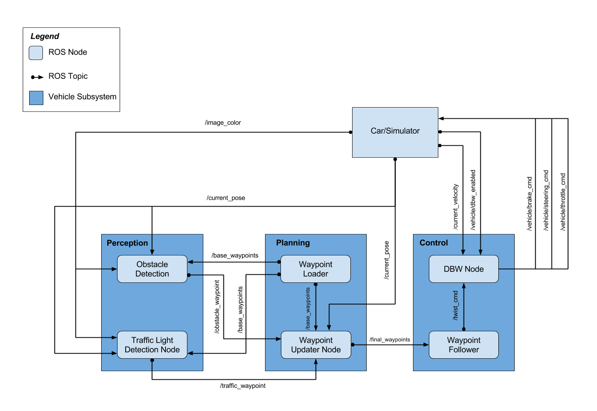

# Udacity Self-Driving Car Capstone Project

Write ROS nodes to implement core functionality of the autonomous vehicle system, including traffic light detection, control, and waypoint following.

## Usage

1. Clone the project repository

2. Install python dependencies
```bash
cd CarND-Capstone
pip install -r requirements.txt
```

3. Download necessary model files if they are missing from folder:

\ros\src\tl_detector\light_classification\model

[frozen_inference_graph_mobilenet.pb](http://download.tensorflow.org/models/object_detection/ssd_mobilenet_v1_coco_11_06_2017.tar.gz)

[frozen_inference_graph_rfcn_resnet101.pb](http://download.tensorflow.org/models/object_detection/rfcn_resnet101_coco_11_06_2017.tar.gz)

Extract the .pb files to the specified folder, and rename them as above.

4. Make and run styx
```bash
cd ros
catkin_make
source devel/setup.sh
roslaunch launch/styx.launch
```
4. Run the simulator

## Code Structure

The code and folder structures follow the basic pipeline provided by Udacity as shown below.



### waypoint_updater node

Like the name suggests, this node first processes the base waypoints of the map, current position of the car, and traffic light state.  Then, propose a set of waypoints for the car to follow.  To save overhead computation, we shortened the number of waypoints to 100, and also removed every other waypoint before publishing them.  When coming close to a yellow/red light, the node checks for its current velocity and distance to the stopline, and calculate appropriate deceleration rate.  If the traffic light just turns yellow when the car is approaching, the node will determine if the distance is long enough to brake safely.

### twist_controller node

Our code contains two PID controllers, one for throttle, and one for brake.  The throttle PID is mostly limited by the maximum throttle set in the code so the acceleration is very smooth and comfortable.  For brake PID, we use a set of parameters that will provide smooth and comfortable deceleration, which can be observed in the vdieo provided in the Results section.

### tl_detector node


## Results

### styx.launch

Our car is able to smoothly follow waypoints at speed limit, dectect traffic light signals using object detection and image classifier to stop the car before stopline at very smooth and comfortable deceleration.  Video linke is below:

[](http://www.youtube.com/watch?v=2w_00uRn1ec)

Our object detection uses frozen inference graph from SSD MobileNet V1 COCO 11.06.2017.  Detected traffic light images are resized to 32x32 pixel images and fed into custom trained CNN which has two sets of convolution and pooling layers, and followed by flattening and three fully connected layers to have three outcome nodes for green, yellow, and red classifications.  For more information on the CNN, the model structure is stored under ```Capstone-Project/ros/src/tl_detector/light_classification/```

### stie.launch

We found that MobileNet is not adequate for real traffic light iamge inference, so another frozen inference graph, RFCN ResNet101 COCO 11.06.2017 is used.  Also another custom CNN model was trained with real traffic light images.  When launching ROS with ```stie.launch```, these are used instead of MobileNet.

RFCN ResNet is more power and accurate, but it takes more computation power to run in real time.  Since our ROS setup is in VM, we cannot utilize our GPU for running inferences.  We instead extracted all images from rosbag provided by Udacity and tested offline.

## Notes to Reviewer
The team:

Danfeng Xu (danfenx@g.clemson.edu)
Roopak Ingole (roopak.ingole@gmail.com)
Ying Tang (tangtang_com@hotmail.com)
Wayne Chen (waynecoffee@hotmail.com)
